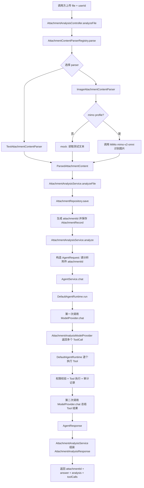
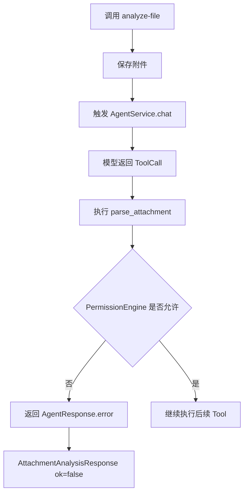

# /attachment-analysis/analyze-file 流程说明

`POST /attachment-analysis/analyze-file` 是面向其他服务集成的一体化接口：调用方一次上传文件，服务端立即保存附件、触发 Agent 分析，并返回结构化分析结果。

默认 profile 使用文本附件模拟 OCR / 文件解析结果，适合上传 `.txt` 文件。启用 `mimo` profile 后，`image/*` 会通过 MiMo 多模态模型解析图片内容。PDF 和 Markdown 已接入独立的大纲提炼入口；Word 的真实解析 adapter 后续继续通过 parser 扩展。

## 请求

```text
POST /attachment-analysis/analyze-file
Content-Type: multipart/form-data
```

表单字段：

```text
userId  text  当前 demo 中必须是 attachment-reviewer 才有分析权限
file    file  建议上传 UTF-8 文本文件，内容模拟 OCR / 解析结果
```

示例：

```bash
curl -sS -F 'userId=attachment-reviewer' \
  -F 'file=@/Users/sean/Desktop/id-card.txt;type=text/plain' \
  http://127.0.0.1:8080/attachment-analysis/analyze-file
```

MiMo 图片解析示例：

```bash
mvn -pl agent-attachment-analysis-demo spring-boot:run \
  -Dspring-boot.run.profiles=mimo

curl -sS -F 'userId=attachment-reviewer' \
  -F 'file=@/Users/sean/Desktop/id-card.png;type=image/png' \
  http://127.0.0.1:8080/attachment-analysis/analyze-file
```

文本附件示例：

```text
居民身份证 姓名 张三 公民身份号码 110101200901011234 出生日期 2009-01-01
```

## 总体流程



## 关键链路

### 1. Controller 接收 multipart 并委托 parser

入口类：

```text
api/AttachmentAnalysisController.java
```

核心逻辑：

```java
@PostMapping(value = "/attachment-analysis/analyze-file", consumes = MediaType.MULTIPART_FORM_DATA_VALUE)
public AttachmentAnalysisResponse analyzeFile(@RequestParam("file") MultipartFile file,
                                              @RequestParam("userId") String userId) throws IOException {
    ParsedAttachmentContent parsed = parserRegistry.parse(file);
    return analysisService.analyzeFile(file.getOriginalFilename(), file.getContentType(), parsed, userId);
}
```

Controller 不再直接解析文件 IO，而是交给 `AttachmentContentParserRegistry` 选择具体 parser。

当前 parser：

```text
TextAttachmentContentParser   支持 text/* 和 .txt
ImageAttachmentContentParser  支持 image/*，默认 mock；mimo profile 下调用 MiMo
MarkdownAttachmentContentParser 支持 .md / .markdown
PdfAttachmentContentParser    支持文本型 PDF，基于 PDFBox
```

真实 MiMo 多模态 / OCR 接入已经收敛在 `ImageAttachmentContentParser`，Controller 不处理文件 IO 细节。PDF / Markdown 解析同样走 `AttachmentContentParser` 扩展点。后续接入 Word 或企业 OCR 时，继续新增或替换 parser，不改业务入口。

### MiMo 图片解析细节

`ImageAttachmentContentParser` 在 `attachment.parser.image.mode=mimo` 时执行真实模型调用：

```text
MultipartFile bytes
-> base64 data:image/... URL
-> OpenAI-compatible messages content:
   text prompt + image_url
-> POST ${AGENTHUB_MIMO_BASE_URL}/chat/completions
-> model: ${AGENTHUB_MODEL_MIMO_IMAGE:mimo-v2-omni}
-> 解析 choices[0].message.content
-> JSON 字段归一化为后续 Tool 可识别文本
```

需要注意：`mimo-v2.5-pro` 是文本/推理模型，本地真实测试返回 `No endpoints found that support image input`；图片解析应使用 `/models` 中支持图像输入的 `mimo-v2-omni`。

## PDF / Markdown 大纲提炼

`POST /attachment-analysis/outline-file` 是面向 PDF / Markdown 的文档大纲和重点提炼接口。它复用同一套上传解析扩展点，但不进入身份证 / 材料审核 Tool 链路。

请求：

```text
POST /attachment-analysis/outline-file
Content-Type: multipart/form-data

userId  text  当前 demo 中必须是 attachment-reviewer
file    file  支持 .md / .markdown / application/pdf
```

默认 profile：

```text
MultipartFile
-> AttachmentContentParserRegistry
-> MarkdownAttachmentContentParser 或 PdfAttachmentContentParser
-> AttachmentRepository.save
-> DocumentOutlineService 本地提炼 title / outline / keyPoints
-> 返回 DocumentOutlineResponse
```

`mimo` profile：

```text
MultipartFile
-> parser 提取文本
-> DocumentOutlineService
-> POST ${AGENTHUB_MIMO_BASE_URL}/chat/completions
-> model: ${AGENTHUB_MODEL_MIMO_TEXT:mimo-v2.5-pro}
-> 要求模型返回 JSON: title / summary / outline / keyPoints
-> 返回结构化 DocumentOutlineResponse
```

示例：

```bash
curl -sS -F 'userId=attachment-reviewer' \
  -F 'file=@/Users/sean/Desktop/policy.md;type=text/markdown' \
  http://127.0.0.1:8080/attachment-analysis/outline-file
```

```bash
curl -sS -F 'userId=attachment-reviewer' \
  -F 'file=@/Users/sean/Desktop/policy.pdf;type=application/pdf' \
  http://127.0.0.1:8080/attachment-analysis/outline-file
```

响应示例：

```json
{
  "attachmentId": "att-xxx",
  "ok": true,
  "outline": {
    "attachmentId": "att-xxx",
    "filename": "policy.md",
    "parserName": "markdown",
    "title": "招生政策解读",
    "summary": "已解析 policy.md，提炼出 3 个大纲节点和 2 条重点。",
    "outline": ["招生政策解读", "报名条件", "录取重点"],
    "keyPoints": ["考生需要关注报名时间、资格审核和材料提交要求。"],
    "metadata": {
      "format": "markdown",
      "textLength": 96
    }
  },
  "errorMessage": null
}
```

### 2. Application Service 保存附件并触发分析

入口类：

```text
application/AttachmentAnalysisService.java
```

`analyzeFile` 先保存 parser 结果：

```java
AttachmentRecord record = repository.save(filename, contentType, parsed);
return analyze(record.getAttachmentId(), userId, null);
```

保存后进入 `analyze`：

```java
AgentRequest request = new AgentRequest();
request.setSessionId(resolveSessionId(sessionId));
request.setUserId(userId);
request.setMessage("请分析附件 " + attachmentId);

AgentResponse agentResponse = agentService.chat(request);
return toResponse(attachmentId, agentResponse);
```

这里的关键点是：业务接口没有直接执行所有分析逻辑，而是复用 AgentHub 的 `AgentService`，让 AgentRuntime 统一处理 Tool 调度、权限、审计和最终总结。

### 3. AgentRuntime 第一次调用模型，得到 ToolCall

核心类：

```text
agent-core/runtime/DefaultAgentRuntime.java
```

第一次模型调用：

```java
ModelRequest modelRequest = buildModelRequest(request);
ModelResponse modelResponse = modelProvider.chat(modelRequest);
```

当前 demo 使用规则型 mock model：

```text
application/AttachmentAnalysisModelProvider.java
```

当 message 包含 `请分析附件 att-...` 时，它返回 5 个 ToolCall：

```text
parse_attachment
classify_document
extract_document_fields
check_document_rules
summarize_attachment_analysis
```

### 4. Runtime 执行 Tool，并统一处理权限和审计

`DefaultAgentRuntime` 会逐个执行 Tool：

```java
for (ToolCall toolCall : modelResponse.getToolCalls()) {
    ToolResult toolResult = executeTool(request, context, toolCall, toolCallResults);
    if (!toolResult.isSuccess()) {
        return AgentResponse.error(toolResult.getErrorMessage());
    }
    toolExecutionResults.add(new ToolExecutionResult(toolCall, toolResult));
}
```

每个 Tool 执行前都会经过：

```text
READ 风险等级校验
必填参数校验
PermissionEngine.check
```

当前 demo 权限逻辑：

```text
infrastructure/AttachmentPermissionEngine.java
```

只有 `userId=attachment-reviewer` 可以分析附件。否则第一个 Tool `parse_attachment` 会被拒绝，并记录失败审计。

### 5. 第二次调用模型，生成 answer

所有 Tool 成功后，Runtime 会把 Tool 执行结果放回 `ModelRequest`：

```java
summarizeRequest.setLastToolExecutions(toolExecutionResults);
summarizeRequest.setLastToolCall(lastExecution.getToolCall());
summarizeRequest.setLastToolResult(lastExecution.getToolResult());
ModelResponse summarizeResponse = modelProvider.chat(summarizeRequest);
```

`AttachmentAnalysisModelProvider` 看到 `lastToolExecutions` 不为空时，不再返回 ToolCall，而是生成最终 answer：

```java
if (request.getLastToolExecutions() != null && !request.getLastToolExecutions().isEmpty()) {
    return ModelResponse.answer(buildAnswer(request.getLastToolExecutions()));
}
```

这一步的作用是把链路从“调用工具”切换到“总结工具结果”，避免重复触发 ToolCall。

### 6. 业务响应组装结构化 analysis

`AttachmentAnalysisService.toResponse` 会把 `AgentResponse` 转成业务响应：

```java
response.setAttachmentId(attachmentId);
response.setOk(agentResponse.isOk());
response.setAnswer(agentResponse.getAnswer());
response.setAnalysis(AttachmentToolSupport.analysisResult(attachmentId, repository.getRequired(attachmentId)));
response.setErrorMessage(agentResponse.getErrorMessage());
response.setToolCalls(agentResponse.getToolCalls());
```

所以最终响应同时包含：

```text
answer     面向用户或调试的自然语言 / 字符串摘要
analysis   面向系统集成的结构化结果
toolCalls  本次 Agent 调用了哪些 Tool
```

## 成功响应示例

```json
{
  "attachmentId": "att-xxx",
  "ok": true,
  "answer": "附件分析结果：{attachmentId=att-xxx, documentType=ID_CARD, birthDate=2009-01-01, age=17, adult=false, passed=false, opinion=建议驳回，原因是申请人未满 18 周岁}",
  "analysis": {
    "attachmentId": "att-xxx",
    "documentType": "ID_CARD",
    "birthDate": "2009-01-01",
    "age": 17,
    "adult": false,
    "passed": false,
    "opinion": "建议驳回，原因是申请人未满 18 周岁"
  },
  "errorMessage": null,
  "toolCalls": [
    {
      "tool": "parse_attachment",
      "success": true,
      "errorMessage": null
    },
    {
      "tool": "classify_document",
      "success": true,
      "errorMessage": null
    },
    {
      "tool": "extract_document_fields",
      "success": true,
      "errorMessage": null
    },
    {
      "tool": "check_document_rules",
      "success": true,
      "errorMessage": null
    },
    {
      "tool": "summarize_attachment_analysis",
      "success": true,
      "errorMessage": null
    }
  ]
}
```

## 失败分支



无权限时常见响应：

```json
{
  "attachmentId": "att-xxx",
  "ok": false,
  "answer": null,
  "analysis": null,
  "errorMessage": "Tool permission denied: Only attachment-reviewer can analyze attachments",
  "toolCalls": []
}
```

## 当前限制

```text
1. Text / Markdown parser 只按 UTF-8 文本读取上传文件。
2. Image parser 默认是 mock；启用 mimo profile 后走 MiMo 多模态识别。
3. 当前 ModelProvider 仍是 mock 规则模型，不是真实 LLM；本 demo 真实 AI 目前接在图片解析/OCR 层。
4. analysis 结果目前由 demo 规则直接计算，后续应沉淀更清晰的领域服务。
5. age 计算基准固定在 2026-06-10，后续应改成可注入 Clock。
6. UNKNOWN / 缺失字段场景后续应返回 REVIEW_REQUIRED，而不是简单通过。
7. PDF parser 当前只覆盖文本型 PDF；扫描件 PDF 需要后续接 OCR。
8. `/attachment-analysis/outline-file` 默认本地提炼只做轻量规则，复杂总结建议启用 mimo profile。
```
