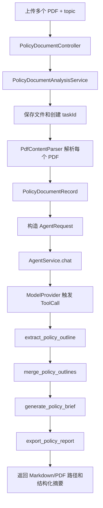

# 多 PDF 政策文件梳理能力接入规划

生成日期：2026-06-11

## 1. 背景

本次在 `university-major-guide` 中完成了一次手工验证流程：

```text
多个 PDF 政策文件
-> 抽取目录和关键章节
-> 结合外部结构化数据
-> 形成政策解读、专业方向、院校建议
-> 导出 Markdown 和 PDF
```

这个流程可以沉淀为 AgentHub 的一个文件分析业务样板，面向“多政策文件整合、提纲梳理、决策建议生成、报告导出”等场景。

建议先接入到 `agent-document-processing`，不要放入 `agent-core`。原因是 PDF 解析、OCR、政策领域提示词、报告模板、导出格式都属于业务能力；`agent-core` 只负责 Agent Runtime、Tool、权限、审计、记忆和模型抽象。

## 2. 目标

第一阶段目标：

1. 支持上传多个 PDF 文件。
2. 对每个 PDF 提取基础元数据、目录、正文文本和关键章节。
3. 将多个文件合并成统一的政策提纲。
4. 生成 Markdown 格式的大纲提要和建议报告。
5. 可选导出 PDF。
6. 全流程经过 AgentHub 的 Tool 调度、权限校验和审计记录。

非目标：

1. 不在第一阶段做复杂前端。
2. 不把 PDF/OCR 解析逻辑放入 `agent-core`。
3. 不追求一次性覆盖所有 PDF 版式，先支持文本型 PDF，再扩展扫描件 OCR。
4. 不在仓库中保存政策文件原件或模型 API Key。

## 3. 推荐模块边界

继续使用现有模块：

```text
agent-document-processing
```

推荐新增包：

```text
agent-document-processing/src/main/java/com/sean/agenthub/agent/attachment/policy
├─ api
├─ application
├─ domain
├─ infrastructure
├─ tool
└─ support
```

也可以先不拆新顶层包，沿用现有结构，在命名上加 `Policy` 前缀。若后续政策分析能力明显变大，再拆为独立 demo 模块：

```text
agent-policy-document-demo
```

第一阶段更建议先留在 `agent-document-processing`，复用上传、解析、Tool、权限、审计、模型调用链路。

## 4. 推荐业务流程

### 4.1 上传与任务创建

新增接口：

```text
POST /policy-documents/analyze
Content-Type: multipart/form-data
```

表单字段：

```text
userId       text    当前用户
topic        text    分析主题，例如“山东高考 450-500 分专业院校建议”
files        file[]  多个 PDF，可混合上传国家、省级、市级政策文件
outputTypes  text[]  md / pdf，默认 md
```

返回：

```json
{
  "ok": true,
  "taskId": "policy-task-xxx",
  "markdownPath": "output/policy-task-xxx/report.md",
  "pdfPath": "output/policy-task-xxx/report.pdf",
  "outline": {},
  "errorMessage": null
}
```

### 4.2 总体链路



## 5. Domain 设计

### 5.1 PolicyDocumentRecord

```java
public class PolicyDocumentRecord {
    private String documentId;
    private String taskId;
    private String filename;
    private String contentType;
    private int pageCount;
    private String title;
    private List<PolicySection> sections;
    private String fullText;
    private Map<String, Object> metadata;
}
```

### 5.2 PolicySection

```java
public class PolicySection {
    private String heading;
    private int level;
    private Integer pageStart;
    private Integer pageEnd;
    private String text;
    private List<String> keywords;
}
```

### 5.3 PolicyAnalysisTask

```java
public class PolicyAnalysisTask {
    private String taskId;
    private String topic;
    private String userId;
    private List<String> documentIds;
    private PolicyOutline mergedOutline;
    private PolicyBriefResult result;
    private String markdownPath;
    private String pdfPath;
}
```

### 5.4 PolicyBriefResult

```java
public class PolicyBriefResult {
    private String title;
    private List<String> executiveSummary;
    private List<PolicyDirection> directions;
    private List<String> recommendations;
    private List<String> risks;
    private List<String> nextSteps;
    private List<PolicySourceRef> sources;
}
```

## 6. Parser 设计

现有入口：

```text
infrastructure/parser/AttachmentContentParser
```

建议新增：

```text
PdfAttachmentContentParser
```

职责：

1. 识别 `application/pdf` 和 `.pdf`。
2. 解析页数、标题、基础元数据。
3. 提取文本型 PDF 正文。
4. 尝试识别目录和章节标题。
5. 返回 `ParsedAttachmentContent`，同时在 `metadata` 中带上页数、章节等结构化信息。

Java 依赖建议：

```xml
<dependency>
  <groupId>org.apache.pdfbox</groupId>
  <artifactId>pdfbox</artifactId>
  <version>2.0.31</version>
</dependency>
```

第一阶段用 PDFBox 处理文本型 PDF。扫描件 OCR 后续再接：

```text
PDFBox 渲染页面
-> OCR adapter
-> 合并 OCR 文本
```

## 7. Tool 设计

建议新增 4 个 Tool。全部放在 `agent-document-processing/src/main/java/.../tool`。

### 7.1 extract_policy_outline

输入：

```json
{
  "taskId": "policy-task-xxx",
  "documentId": "doc-xxx"
}
```

输出：

```json
{
  "documentId": "doc-xxx",
  "title": "山东省国民经济和社会发展第十五个五年规划纲要",
  "sections": [],
  "keywords": ["人工智能", "数字经济", "现代海洋", "绿色低碳"]
}
```

职责：

1. 从解析后的文本中抽章节。
2. 标记政策重点。
3. 保留页码引用。

### 7.2 merge_policy_outlines

输入：

```json
{
  "taskId": "policy-task-xxx"
}
```

职责：

1. 合并多份政策文件提纲。
2. 找共同主题。
3. 找地区特色主题。
4. 输出统一大纲。

适合输出结构：

```text
国家共同方向
山东/地方特色方向
产业方向
教育/专业映射方向
风险和限制
```

### 7.3 generate_policy_brief

输入：

```json
{
  "taskId": "policy-task-xxx",
  "topic": "山东高考 450-500 分专业院校建议",
  "audience": "家长"
}
```

职责：

1. 根据合并大纲生成面向特定主题的报告。
2. 输出 Markdown 草稿。
3. 附上政策来源和页码引用。

### 7.4 export_policy_report

输入：

```json
{
  "taskId": "policy-task-xxx",
  "outputTypes": ["md", "pdf"]
}
```

职责：

1. 写入 Markdown。
2. 可选导出 PDF。
3. 返回文件路径。

PDF 导出建议优先级：

1. 若本地有 Typora CLI 或 Pandoc，可配置外部导出器。
2. Java 内部可先用 Markdown 文件作为主产物，PDF 作为可选。
3. ReportLab 属于 Python 方案，不建议直接放进 Java 项目主链路；可以作为外部 worker 或本地工具。

## 8. ModelProvider 编排策略

当前 `agent-document-processing` 有 `AttachmentAnalysisModelProvider`，它是规则型 mock provider，会根据用户消息返回固定 ToolCall。

建议新增：

```text
PolicyDocumentAnalysisModelProvider
```

识别消息：

```text
请分析政策文件任务 policy-task-xxx
```

返回 ToolCall 顺序：

```text
extract_policy_outline      对每个 documentId 执行
merge_policy_outlines       合并全部提纲
generate_policy_brief       生成 Markdown 报告
export_policy_report        导出文件
```

第一阶段可用规则型 provider 保证链路稳定；第二阶段再切到真实 LLM：

```text
解析与结构化尽量由 Tool 完成
模型负责摘要、归纳、改写、建议生成
```

## 9. 权限与审计

权限建议：

```text
policy-document-reader    可上传和分析政策文件
policy-document-exporter  可导出报告
admin                     可查看任务和历史记录
```

当前 demo 可以先复用：

```text
userId=attachment-reviewer
```

审计事件建议记录：

```text
上传文件名、大小、contentType
解析成功/失败
每个 ToolCall 的输入参数和结果状态
导出文件路径
模型 provider 名称
```

注意：审计中不要记录完整 PDF 正文，避免日志过大和敏感信息泄漏。

## 10. 文件存储策略

第一阶段使用本地目录：

```text
agent-document-processing/work/policy-tasks/{taskId}/
├─ uploads/
├─ parsed/
├─ report.md
└─ report.pdf
```

仓库 `.gitignore` 应忽略：

```text
agent-document-processing/work/
```

后续可替换为对象存储或业务系统文件服务。

## 11. 配置项

建议新增配置：

```yaml
agent:
  attachment:
    policy:
      enabled: true
      work-dir: agent-document-processing/work/policy-tasks
      max-files: 10
      max-file-size-mb: 50
      pdf:
        parser: pdfbox
        max-pages: 300
        extract-layout: true
      export:
        markdown: true
        pdf: false
        pdf-command:
```

如果后续要使用外部命令导出 PDF：

```yaml
agent:
  attachment:
    policy:
      export:
        pdf: true
        pdf-command: typora-export
```

外部命令必须走白名单，不能让用户直接传任意 shell。

## 12. API 规划

### 12.1 上传并分析

```text
POST /policy-documents/analyze
```

请求：

```bash
curl -sS \
  -F 'userId=attachment-reviewer' \
  -F 'topic=山东高考 450-500 分专业院校建议' \
  -F 'outputTypes=md' \
  -F 'files=@/path/to/十五五规划.pdf;type=application/pdf' \
  -F 'files=@/path/to/山东十五五.pdf;type=application/pdf' \
  http://127.0.0.1:8080/policy-documents/analyze
```

### 12.2 查询任务

```text
GET /policy-documents/tasks/{taskId}
```

### 12.3 下载报告

```text
GET /policy-documents/tasks/{taskId}/report.md
GET /policy-documents/tasks/{taskId}/report.pdf
```

第一阶段可以只返回本地路径，不做下载接口；如果作为业务 demo 给其他系统用，建议补下载接口。

## 13. 依赖选择

### 13.1 PDF 文本解析

优先：

```text
Apache PDFBox 2.x
```

原因：

1. Java 8 兼容。
2. 适合当前 Spring Boot 2 / JDK 8 MVP 边界。
3. 不引入 Python 运行时。

### 13.2 Markdown 生成

直接 Java 字符串模板即可。建议封装：

```text
PolicyMarkdownRenderer
```

不要让 Tool 里散落大量拼接逻辑。

### 13.3 PDF 导出

建议分阶段：

1. 第一阶段只保证 Markdown。
2. 第二阶段接入可配置 PDF exporter。
3. 第三阶段再考虑 HTML 模板 + PDF 渲染。

可选方案：

```text
Typora/Pandoc 外部命令：本地个人工作流方便，但服务器部署依赖较重。
OpenHTMLToPDF：Java 内部生成 PDF，适合服务化，但中文字体和 CSS 需要调试。
iText/Flying Saucer：可行，但授权和兼容性要确认。
```

## 14. 实施步骤

### Phase 1：规划和最小链路

1. 新增本规划文档。
2. 新增 `PdfAttachmentContentParser`，支持文本型 PDF。
3. 新增 `PolicyDocumentRepository`，内存保存任务和文档。
4. 新增 `PolicyDocumentAnalysisController`。
5. 新增 4 个 Policy Tool。
6. 新增规则型 `PolicyDocumentAnalysisModelProvider`。
7. 支持输出 Markdown。
8. 增加集成测试：上传两个 PDF，返回 Markdown 路径和提纲摘要。

### Phase 2：质量提升

1. 优化目录识别。
2. 增加关键词抽取。
3. 增加页码引用。
4. 支持超长 PDF 分块摘要。
5. 支持真实 LLM provider 生成更自然的报告。
6. 增加报告模板。

### Phase 3：导出和产品化

1. 接入 PDF exporter。
2. 增加报告下载接口。
3. 增加任务历史。
4. 增加失败重试和任务状态。
5. 支持 Word/Excel/网页政策文件。
6. 支持 Gateway 模式，把政策分析作为平台 Tool 对外暴露。

## 15. 测试策略

单元测试：

```text
PdfAttachmentContentParserTest
PolicyMarkdownRendererTest
PolicyDocumentRepositoryTest
Policy Tool 参数校验测试
```

集成测试：

```text
PolicyDocumentAnalysisApplicationTest
```

覆盖：

1. 上传两个 PDF。
2. 生成 taskId。
3. 执行 ToolCall 链。
4. 返回 Markdown 路径。
5. 权限不足时拒绝。
6. 非 PDF 文件时返回清晰错误。

验收样例：

```text
输入：十五五规划.pdf + 山东十五五.pdf + topic=山东高考 450-500 分专业院校建议
输出：包含国家重点、山东重点、专业映射、院校建议、填报步骤的 Markdown 报告
```

## 16. 风险和注意事项

1. PDF 文字抽取可能乱码。需要保留“文本型 PDF”和“扫描 PDF OCR”的分支。
2. 中文 PDF 导出容易出现字体兼容问题。服务端导出时必须嵌入字体。
3. 超长政策文件不能一次性塞给模型，应先用 Tool 分章节抽取，再分块归纳。
4. 报告中涉及高考、政策、就业建议时，应标注来源和不确定性。
5. 文件路径不能直接暴露任意本地目录，下载接口应限制在任务工作目录。
6. 外部命令导出 PDF 必须白名单配置，不能执行用户输入命令。

## 17. 推荐落点

短期落点：

```text
agent-document-processing
```

核心新增能力：

```text
PdfAttachmentContentParser
PolicyDocumentAnalysisController
PolicyDocumentAnalysisService
PolicyDocumentRepository
ExtractPolicyOutlineTool
MergePolicyOutlinesTool
GeneratePolicyBriefTool
ExportPolicyReportTool
PolicyMarkdownRenderer
```

不建议改动：

```text
agent-core
agent-spring-boot-starter
agent-model-provider-http
```

除非发现核心抽象不能支持多文件任务，否则第一阶段不改平台内核。
